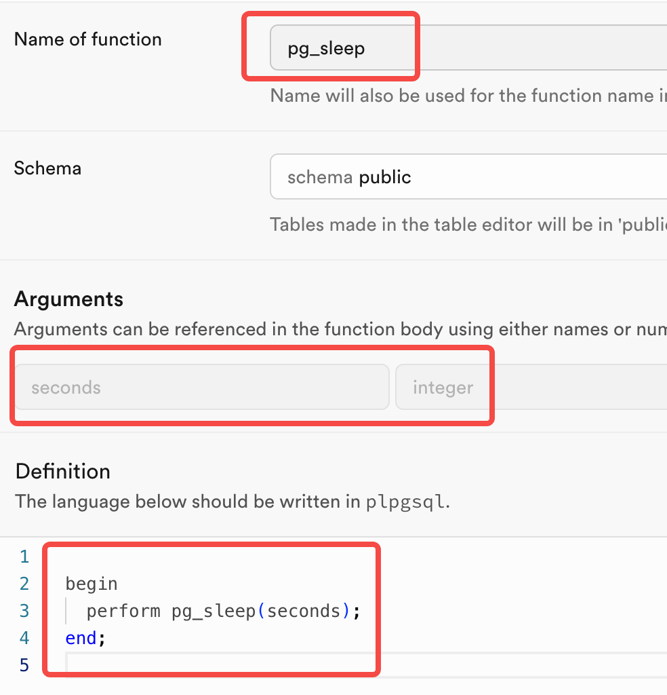

# Supabase Keep Alive Script

Keep your Supabase projects **warm and responsive** with this simple Node.js script and GitHub Actions workflow. Designed to ping your projects **locally** or via **CI** to prevent cold starts or inactivity delays.

---

## 📦 Features

- ✅ Ping **multiple Supabase projects**
- ✅ Run manually on your laptop (`node keepalive.js`)
- ✅ Automated schedule via **GitHub Actions**
- ✅ Secure via `.env` (local) or GitHub Secrets (CI)
- ✅ Easily extendable — add new projects via `projects.json`

---

## 🚀 Getting Started

### 1. Clone the Repo

```bash
git clone https://github.com/your-username/supabase-keepalive.git
cd supabase-keepalive
```

### 2. Install Dependencies

```bash
npm install
```

---

## 🔐 Configuring Projects

### Add Your Projects to `projects.json`

```json
[
	{
		"name": "DeadSimpleForm",
		"url": "https://dsf.supabase.co",
		"envKey": "DSF_SUPABASE_KEY"
	},
	{
		"name": "Deddit",
		"url": "https://deddit.supabase.co",
		"envKey": "DEDDIT_SUPABASE_KEY"
	}
]
```

- `name`: Label for logs
- `url`: Your Supabase project base URL
- `envKey`: Name of the environment variable that holds your Supabase API key

---

### Set Your Keys in `.env`

Create a `.env` file in the project root:

```env
DSF_SUPABASE_KEY=your-supabase-anon-or-service-role-key
DEDDIT_SUPABASE_KEY=your-other-project-key
```

> ⚠️ Do **not** commit this file — it’s in `.gitignore`.

---

## 🖥 Running Locally

```bash
node keepalive.js
```

This will:

- Loop through all projects in `projects.json`
- Use your `.env` file to fetch each project’s key
- Ping a lightweight Supabase RPC or query to keep it active

---

## 🤖 GitHub Actions (Auto Ping Twice a Week)

This project includes a GitHub Actions workflow (`.github/workflows/keepalive.yml`) that runs **every Monday and Thursday at 05:00 UTC**.

### Setup GitHub Secrets

Go to your repo → **Settings → Secrets and Variables → Actions** → **New Repository Secret**

Add all the env keys mentioned in `projects.json`, e.g.:

- `DSF_SUPABASE_KEY`
- `DEDDIT_SUPABASE_KEY`

Once added, your repo will automatically ping all projects twice a week.

---

## 📚 How It Works

### Script: `keepalive.js`

- Imports `projects.json`
- Loops through each project
- Uses `@supabase/supabase-js` to run:

```js
await supabase.rpc("pg_sleep", { seconds: 0 });
```

> You can replace this with any lightweight query like:
>
> ```js
> await supabase.from("your_table").select("id").limit(1);
> ```
>
> this table should exist in your database, need be public?

---

## 🧪 Optional: Add `pg_sleep` to Your Supabase Projects

If you'd like to use the `pg_sleep` RPC as your ping, it needs to be created in each Supabase project:

> dashboard → SQL Editor → New Query and text below --> Run

```sql
create function pg_sleep(seconds integer)
returns void as $$
begin
  perform pg_sleep(seconds);
end;
$$ language plpgsql;
```

> OR:
> dashboard → Database → Functions → Create new Function → change `Name of function` and `Arguments` and `Definition` like the image shows -> Save



Otherwise, use a regular SELECT query in the script.

Then, you can see the real request via Supabase dashboard → `Reports` or `Logs` panel → `API Gateway` or `PostgREST` panel.

---

## 📁 Project Structure

```
supabase-keepalive/
├── keepalive.js              # Main script
├── projects.json             # Project list
├── .env                      # Local secrets (gitignored)
├── .gitignore
├── package.json
└── .github/
    └── workflows/
        └── keepalive.yml    # GitHub Actions workflow
```

---

## 🔄 Schedule

This workflow is triggered on:

- 🗓️ **Monday** at 05:00 UTC
- 🗓️ **Thursday** at 05:00 UTC

Modify `.github/workflows/keepalive.yml` if you'd like different timing.

---

## 🧩 Customization Ideas

- Add Slack/Discord alerts on failure
- Log ping results to Supabase itself
- Ping other services (e.g., Vercel functions, Firebase)

---

## 🧼 License

MIT — do what you want, just don't blame me if Supabase gets angry 🐘

---

## 💬 Questions?

Open an issue or ping me on [GitHub Discussions](https://github.com/your-username/supabase-keepalive/discussions) once available.
